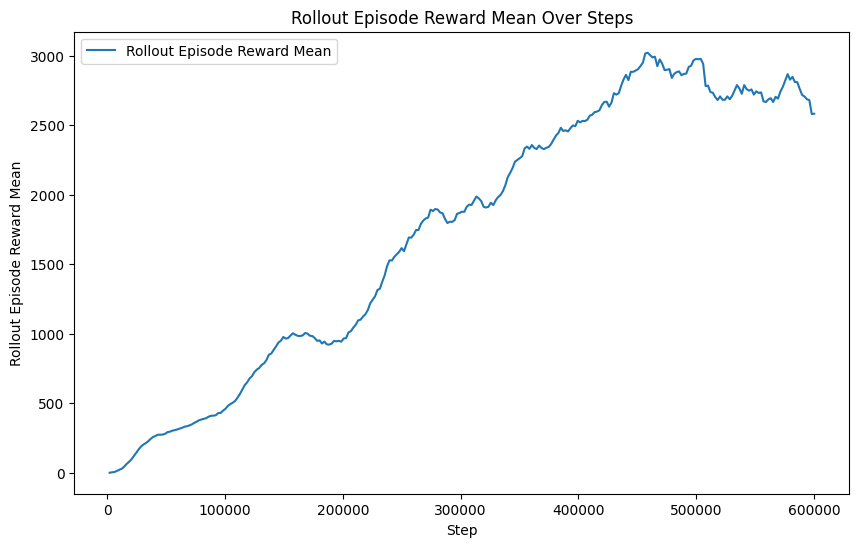
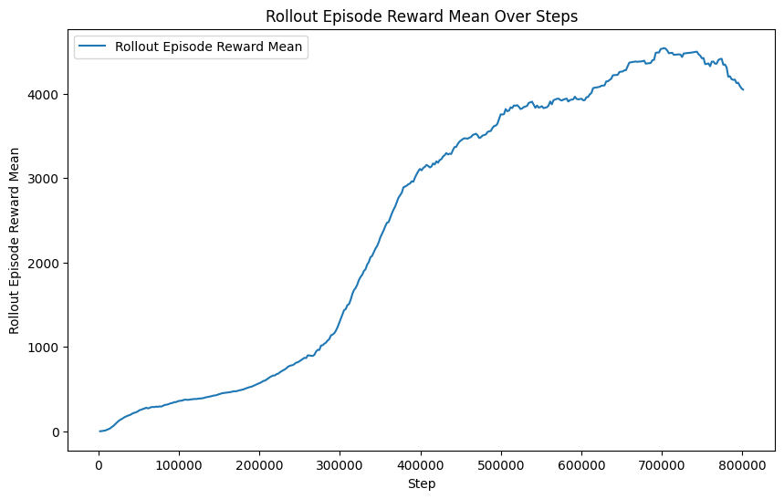

# Walker2d Experimentation w/Custom Reward Policies

## TODO
* Move CustomReward to separate file
* Add mild improvements to leg movement if possible
* Update `README.md` with appropriate changes in 'Approach'
* Clean up Approach section to be less verbose
* Add code requirements + tools section

## Objective/Goals
* Learn to train an RL policy on a humanoid-like figure, while working with some preexisting realistic phsyics engine
* Develop understanding of RL and reward policies
* Deliver learning curves as well as video outputs of trained model

## Approach
Due to CPU limitations, I decided to use a relatively lightweight simulator, and decided on MuJoCo wrapped with gynasium in python. I then proceeded to train a `walker2d-v4`, one of the many available MuJoCo humanoids. First, I trained it with the default reward policy, and upon viewing the learning curve and videos, I realized that the model was falling too soon with the default policy. Thus, I implemented a custom policy that rewards ***stability*** and ***uprightedness*** as well, and not just speed, since this helps the model stabilize and develop more long-term movements. The output videos were longer, reflecting more successful models that could last longer without falling.

## Project Structure
```
walker2d-demo/
├── assets/
|   ├── default_policy_video.gif
|   └── custom_policy_video.gif
├── plots/
|   ├── learning_curve_custom.csv
|   ├── learning_curve_custom.csv
|   ├── learning_curve_default.csv
|   ├── learning_curve_default.png
|   └── plot_learning_curves.ipynb 
├── .gitignore
├── README.md
├── record_video.py
├── requirements.txt 
├── train_walker2d.py
```

## Results
### Default Policy - Learning Curve and Model GIF
 

### Custom Policy - Learning Curve and Model GIF
 

